Our goal with the innosuisse grant has been to create a usable, understandable, 
fast, and short algorithm for anonymized, unlinkable proofs of attributes in a verifiable credential.

To avoid reinventing the wheel, early on, we looked for an open source library where we could contribute our findings to.
However, finding such a library wasn't straight forward!

# The Problem

The open-source ecosystem for privacy-preserving identity is fragmented:

- **Competing standards** pull resources in different directions (W3C VC, SD-JWT, mDL)
- **Maintenance/ Abandon** Rapid evolution leaves many libraries abandoned
- **Security/ Trust** Cryptographic libraries require lots of auditing to be trusted in production applications
- **High Complexity** makes it hard for contributors to join

# Approach
We started our search for a good library that implements what we needed, and for that search we focused on the cryptographic primitives,
being the area we wanted to contribute the most.

After evaluating many options, one library stood out: **Dock Network's crypto library** 
([github.com/docknetwork/crypto](https://github.com/docknetwork/crypto)).

The library was created and open-sourced by [dock.io](https://www.dock.io/); a digital identity startup,
 and Currently maintained 
by their lead cryptographer [Lovesh Harchandani](https://github.com/lovesh)

# Why We Chose Dock

Two factors made it attractive:

1. **Focused scope**: It targets only E-ID cryptography, BBS+ signatures, accumulators, and zero-knowledge proofs.
2. **Full coverage**: From low-level Schnorr proofs to complete proof systems, all in one place, all dedicated to E-ID systems

The codebase is well-engineered. Each primitive lives in its own Rust crate. Code references academic papers.
It supports backend servers, and WebAssembly for browsers.

| Category | Primitives |
|----------|------------|
| **Signatures** | BBS+, BBS, PS, group signatures |
| **Credentials** | Coconut, KVAC, Delegatable Credentials |
| **Proofs** | Schnorr PoK, Sigma protocols, LegoGroth16, Bulletproofs++, Verifiable encryption |
| **Accumulators** | VB dynamic accumulators |
| **Misc** | , Secret sharing, DKG |

# Library Structure

The library spans three repositories:

1. **Crypto** (Rust): Core cryptographic logic  
   → [github.com/docknetwork/crypto](https://github.com/docknetwork/crypto)

2. **Crypto-Wasm** (Rust/TS): WebAssembly wrapper for browser use  
   → [github.com/docknetwork/crypto-wasm](https://github.com/docknetwork/crypto-wasm)

3. **Crypto-Wasm-TS** (TypeScript): High-level APIs for web developers  
   → [github.com/docknetwork/crypto-wasm-ts](https://github.com/docknetwork/crypto-wasm-ts)

# Contribution
Like most other libraries, this one lacks contributors. However, it's in a very state, and almost feature-complete, and production-ready.

This is why we decided to contribute as much as possible. Over the past year, we've made several 
Pull Requests to add missing documentation and examples 
[[1](https://github.com/docknetwork/crypto-wasm-ts/pull/37)] 
[[2](https://github.com/docknetwork/crypto-wasm-ts/pull/39)] 
[[3](https://github.com/docknetwork/crypto-wasm-ts/pull/42)]
[[4](https://github.com/docknetwork/crypto-wasm-ts/pull/34)] 
[[5](https://github.com/docknetwork/crypto-wasm-ts/pull/35)],

and update the typescript project to latest rust counterpart 
[[6](https://github.com/docknetwork/crypto-wasm-ts/pull/43)]
[[7](https://github.com/docknetwork/crypto-wasm-ts/pull/46)]
[[8](https://github.com/docknetwork/crypto-wasm/pull/16)]
[[9](https://github.com/docknetwork/crypto-wasm/pull/17)]
and we were happy to do some house-keeping and upating the dependencies 
[[10](https://github.com/docknetwork/crypto-wasm/pull/18)]
[[11](https://github.com/docknetwork/crypto-wasm/pull/19)]
[[12](https://github.com/docknetwork/crypto-wasm/pull/20)]
.

# Challenges
During the endeavor, we've seen a couple challenges to contributig to this library.

- **Complicated workflow**: Any change in the API will require changes to 3 repositories to propogate
from rust to the user facing typescript library.  
- **Small team**: Currently, the library only have one maintainer. A great maintainer, 
but taking the bus factor into account, it's not ideal.  
- **Sparse documentation**: Tutorials and guides are lacking. In such a highly technical field, 
documentation and tutorials are much needed to be up-to-date.  
- **Evolving standards**: Needs to track IETF BBS standardization

# Conclusion

Dock's crypto library is the most complete option we've seen for privacy-preserving credentials. 
It's well-structured and covers all we needed to build an E-ID system. 
The main challenge is its small community. Broader adoption would help ensure long-term maintenance.

We've contributed documentation, updates, and integration examples back to the project.

## Library Architecture reference - co-built with LLMs 

The Rust crates follow a layered structure. Lower levels provide primitives. Higher levels build protocols. 
The top-level `proof_system` crate ties everything together for composite proofs.

```mermaid
graph TB
    subgraph L0["Foundation"]
        merlin["merlin"]
    end
    
    subgraph L1["Basic Proofs"]
        schnorr_pok["schnorr_pok"]
        compressed_sigma["compressed_sigma"]
        bulletproofs_plus_plus["bulletproofs_plus_plus"]
        legogroth16["legogroth16"]
    end
    
    subgraph L2["Intermediate"]
        secret_sharing_and_dkg["secret_sharing_and_dkg"]
        oblivious_transfer["oblivious_transfer"]
        kvac["kvac"]
        delegatable_credentials["delegatable_credentials"]
    end
    
    subgraph L3["Schemes"]
        bbs_plus["bbs_plus"]
        coconut["coconut"]
        short_group_sig["short_group_sig"]
        saver["saver"]
        verifiable_encryption["verifiable_encryption"]
    end
    
    subgraph L4["Higher-Level"]
        vb_accumulator["vb_accumulator"]
        smc_range_proof["smc_range_proof"]
        equality_across_groups["equality_across_groups"]
        syra["syra"]
    end
    
    subgraph L5["Integration"]
        proof_system["proof_system"]
    end
    
    %% Foundation connections
    merlin -.-> schnorr_pok
    
    %% Left branch: schnorr_pok -> bbs_plus, short_group_sig, kvac
    schnorr_pok --> bbs_plus
    schnorr_pok --> short_group_sig
    schnorr_pok --> kvac
    
    %% Right branch: schnorr_pok -> coconut, vb_accumulator
    schnorr_pok --> coconut
    schnorr_pok --> vb_accumulator
    
    %% Intermediate to Schemes
    secret_sharing_and_dkg --> bbs_plus
    secret_sharing_and_dkg --> coconut
    
    %% SNARK path
    legogroth16 --> saver
    
    %% All to Integration - grouped to reduce visual clutter
    bbs_plus --> proof_system
    coconut --> proof_system
    short_group_sig --> proof_system
    saver --> proof_system
    verifiable_encryption --> proof_system
    vb_accumulator --> proof_system
    smc_range_proof --> proof_system
    equality_across_groups --> proof_system
    syra --> proof_system
    bulletproofs_plus_plus --> proof_system
    
    %% Styling for better visual hierarchy
    classDef foundation fill:#e1f5ff,stroke:#01579b,stroke-width:2px
    classDef basic fill:#fff4e1,stroke:#e65100,stroke-width:2px
    classDef intermediate fill:#f0f0f0,stroke:#424242,stroke-width:2px
    classDef schemes fill:#e8f5e9,stroke:#2e7d32,stroke-width:2px
    classDef higher fill:#fce4ec,stroke:#c2185b,stroke-width:2px
    classDef integration fill:#fff9c4,stroke:#f57f17,stroke-width:3px
    
    class merlin foundation
    class schnorr_pok,compressed_sigma,bulletproofs_plus_plus,legogroth16 basic
    class secret_sharing_and_dkg,oblivious_transfer,kvac,delegatable_credentials intermediate
    class bbs_plus,coconut,short_group_sig,saver,verifiable_encryption schemes
    class vb_accumulator,smc_range_proof,equality_across_groups,syra higher
    class proof_system integration
```

