When we sat out on our journey to explore E-ID and its applications, the first thing we did was to survey the existing eco-system, understand the existing tools, and connect with the existing actors.

When we wanted to implement our first proof-of-concept for our Diploma Verifiable credential system, the first step was to survey the existing tools people use. This includes cryptographic primitives, communication protocols, storage systems, standard architectures, etc. 

We were and still are most interested in the cryptographic building blocks for E-ID, for that we’ve sat out to look for the state-of-the-art technologies

Open-source is the key driver for state-of-the-art cryptography today, and on the top is E-ID. This is why since the beginning we’ve been looking for an open-source library that support our experiments, and projects in E-ID. This search proved a lot more challenging that we thought. There’s so many projects, and many attempts at a global open-source library, but the space is moving too fast, and many actors want to be at the forefront. This was a reason why many libraries were abandoned, or struggling to find traction in the open-source world. 

The diversity of standards tackling E-ID today as well is causing the efforts to be dispersed in different directions. This is all part of the evolution process of a new topic, but none-the-less made our goal harder.

However, after studying some many libraries, at the end, one of them stood out. This was dock.io’s crypto libraries. http://github.com/docknetwork/crypto

Docknetwork’s attractiveness to us came from two reasons

1. They only focused on the cryptographic constructs needed to build an E-ID system 
2. The wanted to cover all the cryptographic needs from the lower building blocks of build a cryptographic scheme like BBS+ to building a full-blown ZK system. 

This was perfect for our needs. This is where we also see the biggest challenges. This is why we decided to use dock’s crypto libraries. Although, they have a small number of contributors, they still managed to cover many and many cryptographic building blocks.

## Delving deeper into the libraries

### Architecture

The library is split into three github projects.

1. Crypto - Written in Rust
Most of the logic is written in this repo, divided into different crates for the different parts.   
This library covers all the components needed to build a working E-ID system, and adds so much for a ZKP E-ID system as well. However, 
it's worth noting that it doesn't offer a ZK E-ID system.

2. Crypto-Wasm - Written in Rust and Typescript
Since most E-ID systems are (or will be) web systems, rust is limiting. There are other libraries that more suited for web, specifally
for frontend development "Javascript" or "Typescript". This is why crypto-wasm is an intermediary library responsible for building a WASM
interface that makes the rust crates runnable in a javascript/typescript environment. 

3. Crypto-Wasm-TS - written in Typescript
For using the wasm library in javascript project, 

### Dependency Graph

The Dock crypto library consists of many Rust crates organized in a hierarchical dependency structure. The lower-level crates provide cryptographic primitives, while higher-level crates build complex protocols and systems on top of them.

```mermaid
graph TB
    %% Level 0: Foundation (Cryptographic Primitives)
    subgraph L0["Level 0: Foundation - Cryptographic Primitives"]
        merlin["merlin<br/>(Transcript Protocol)"]
    end
    
    %% Level 1: Basic Proof Protocols
    subgraph L1["Level 1: Basic Proof Protocols"]
        schnorr_pok["schnorr_pok<br/>(Schnorr, Okamoto,<br/>Chaum-Pedersen PoK)"]
        compressed_sigma["compressed_sigma<br/>(Compressed Sigma<br/>Protocols)"]
        bulletproofs_plus_plus["bulletproofs_plus_plus<br/>(Bulletproofs++)"]
        legogroth16["legogroth16<br/>(LegoGroth16 zkSNARK)"]
    end
    
    %% Level 2: Intermediate Primitives
    subgraph L2["Level 2: Intermediate Cryptographic Primitives"]
        oblivious_transfer["oblivious_transfer<br/>(OT & OT Extensions)"]
        secret_sharing_and_dkg["secret_sharing_and_dkg<br/>(Secret Sharing & DKG)"]
        kvac["kvac<br/>(Keyed-Verification<br/>Anonymous Credentials)"]
        delegatable_credentials["delegatable_credentials<br/>(DAC Schemes)"]
    end
    
    %% Level 3: Advanced Cryptographic Schemes
    subgraph L3["Level 3: Advanced Cryptographic Schemes"]
        short_group_sig["short_group_sig<br/>(BB & weak-BB<br/>Group Signatures)"]
        bbs_plus["bbs_plus<br/>(BBS+ Signatures &<br/>Threshold BBS+)"]
        coconut["coconut<br/>(Threshold Anonymous<br/>Credentials)"]
        saver["saver<br/>(SNARK-friendly<br/>Verifiable Encryption)"]
        verifiable_encryption["verifiable_encryption<br/>(Verifiable Encryption)"]
    end
    
    %% Level 4: Higher-Level Constructs
    subgraph L4["Level 4: Higher-Level Cryptographic Constructs"]
        vb_accumulator["vb_accumulator<br/>(Bilinear Map<br/>Accumulator)"]
        smc_range_proof["smc_range_proof<br/>(Set-Membership<br/>Range Proofs)"]
        equality_across_groups["equality_across_groups<br/>(Equality Proofs<br/>Across Groups)"]
        syra["syra<br/>(Sybil-Resilient<br/>Anonymous Signatures)"]
    end
    
    %% Level 5: Top-Level Integration
    subgraph L5["Level 5: Top-Level Integration"]
        proof_system["proof_system<br/>(Umbrella Proof System<br/>Comprising All Primitives)"]
    end
    
    %% Dependencies from Level 0
    merlin --> saver
    merlin --> proof_system
    
    %% Dependencies from Level 1
    schnorr_pok --> oblivious_transfer
    schnorr_pok --> secret_sharing_and_dkg
    schnorr_pok --> kvac
    schnorr_pok --> delegatable_credentials
    schnorr_pok --> short_group_sig
    schnorr_pok --> bbs_plus
    schnorr_pok --> coconut
    schnorr_pok --> vb_accumulator
    schnorr_pok --> smc_range_proof
    schnorr_pok --> equality_across_groups
    schnorr_pok --> syra
    schnorr_pok --> proof_system
    
    legogroth16 --> saver
    legogroth16 --> proof_system
    
    bulletproofs_plus_plus --> equality_across_groups
    bulletproofs_plus_plus --> proof_system
    
    %% Dependencies from Level 2
    oblivious_transfer --> short_group_sig
    oblivious_transfer --> bbs_plus
    oblivious_transfer --> vb_accumulator
    
    secret_sharing_and_dkg --> short_group_sig
    secret_sharing_and_dkg --> bbs_plus
    secret_sharing_and_dkg --> coconut
    secret_sharing_and_dkg --> vb_accumulator
    secret_sharing_and_dkg --> verifiable_encryption
    
    kvac --> vb_accumulator
    kvac --> equality_across_groups
    
    %% Dependencies from Level 3
    short_group_sig --> vb_accumulator
    short_group_sig --> smc_range_proof
    short_group_sig --> syra
    short_group_sig --> proof_system
    
    bbs_plus --> proof_system
    
    coconut --> proof_system
    
    saver --> proof_system
    
    verifiable_encryption --> proof_system
    
    %% Dependencies from Level 4
    vb_accumulator --> proof_system
    
    smc_range_proof --> proof_system
    
    equality_across_groups --> proof_system
    
    syra --> proof_system
    
    %% Standalone crates (part of ecosystem but not dependencies of proof_system)
    compressed_sigma -.-> proof_system
    delegatable_credentials -.-> proof_system
    
    %% Styling
    classDef level0 fill:#e1f5ff,stroke:#01579b,stroke-width:2px
    classDef level1 fill:#c8e6c9,stroke:#2e7d32,stroke-width:2px
    classDef level2 fill:#fff9c4,stroke:#f57f17,stroke-width:2px
    classDef level3 fill:#ffe0b2,stroke:#e65100,stroke-width:2px
    classDef level4 fill:#f8bbd0,stroke:#880e4f,stroke-width:2px
    classDef level5 fill:#ce93d8,stroke:#4a148c,stroke-width:3px
    classDef standalone stroke-dasharray: 5 5
    
    class merlin level0
    class schnorr_pok,compressed_sigma,bulletproofs_plus_plus,legogroth16 level1
    class oblivious_transfer,secret_sharing_and_dkg,kvac,delegatable_credentials level2
    class short_group_sig,bbs_plus,coconut,saver,verifiable_encryption level3
    class vb_accumulator,smc_range_proof,equality_across_groups,syra level4
    class proof_system level5
```

**Legend:**
- **Level 0 (Foundation)**: Core cryptographic primitives that form the base layer
- **Level 1 (Basic Proofs)**: Fundamental proof-of-knowledge protocols
- **Level 2 (Intermediate Primitives)**: Building blocks for more complex schemes (OT, secret sharing, basic ZK systems)
- **Level 3 (Advanced Schemes)**: Complete cryptographic schemes (signatures, credentials, encryption)
- **Level 4 (Higher-Level Constructs)**: Complex protocols combining multiple schemes
- **Level 5 (Integration)**: Top-level umbrella crate that integrates all primitives

The dependency structure shows that:
- Lower-level crates (Levels 0-1) focus on cryptographic primitives and basic proof protocols
- Middle-level crates (Levels 2-3) build complete cryptographic schemes
- Higher-level crates (Levels 4-5) provide integrated systems combining multiple primitives

