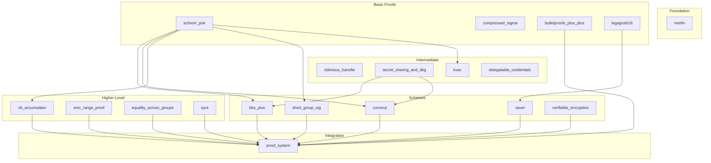

When we sat out on our journey to build an E-ID system (use case: Diploma Verifiable Credential).
Users should prove they hold a degree without revealing their identity. 
For this, we needed a library that supports BBS+ signatures and zero-knowledge proofs. However, finding one proved harder than expected.

# The Problem

The open-source ecosystem for privacy-preserving identity is fragmented:

- **Competing standards** pull resources in different directions (W3C VC, SD-JWT, mDL)
- **Rapid evolution** leaves many libraries abandoned
- **High complexity** makes it hard for contributors to join

After evaluating many options, one stood out: **Dock Network's crypto library** ([github.com/docknetwork/crypto](https://github.com/docknetwork/crypto)).

# Why We Chose Dock

Two factors made it attractive:

1. **Focused scope**: It targets only E-ID primitives—BBS+ signatures, accumulators, and zero-knowledge proofs
2. **Full coverage**: From low-level Schnorr proofs to complete proof systems, all in one place, all dedicated to E-ID systems

The codebase is well-engineered. Each primitive lives in its own Rust crate. Code references academic papers. It supports server builds, embedded systems, and WebAssembly for browsers.

| Category | Primitives |
|----------|------------|
| **Signatures** | BBS+, BBS, PS, group signatures |
| **Credentials** | Coconut, KVAC, Delegatable |
| **Proofs** | Schnorr PoK, Sigma protocols |
| **SNARKs** | LegoGroth16, Bulletproofs++ |
| **Accumulators** | VB dynamic accumulators |
| **Utilities** | Verifiable encryption, Secret sharing, DKG |

# Architecture

The library spans three repositories:

1. **Crypto** (Rust): Core cryptographic logic  
   → [github.com/docknetwork/crypto](https://github.com/docknetwork/crypto)

2. **Crypto-Wasm** (Rust/TS): WebAssembly wrapper for browser use  
   → [github.com/docknetwork/crypto-wasm](https://github.com/docknetwork/crypto-wasm)

3. **Crypto-Wasm-TS** (TypeScript): High-level APIs for web developers  
   → [github.com/docknetwork/crypto-wasm-ts](https://github.com/docknetwork/crypto-wasm-ts)

The Rust crates follow a layered structure. Lower levels provide primitives. Higher levels build protocols. 
The top-level `proof_system` crate ties everything together for composite proofs.

# Room for Improvement

The library has limitations:
- **Over-engineered**: Creating a new version of the typescript library requires updates to 3 versioned repositories
- **Small team**: Few contributors create sustainability risks
- **Sparse documentation**: Tutorials and guides are lacking
- **Evolving standards**: Needs to track IETF BBS standardization

# Conclusion

Dock's crypto library is the most complete option we found for privacy-preserving credentials. 
It's well-structured and covers what you need to build an E-ID system. 
The main challenge is its small community—broader adoption would help ensure long-term maintenance.

We've contributed bug fixes, documentation, and integration examples back to the project.
