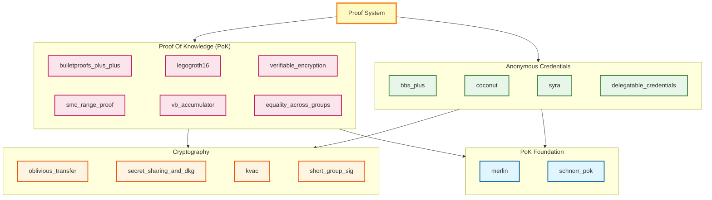

In WP1 we created a list of existing algorithms and tools for anonymous proofs
in electronic identities.
The findings of WP1 were used to create an overview of existing libraries which we can
use to build our research on.
This post describes how we evaluated the relevant libraries we found, and for which ones
we did a deeper evaluation.

## The Challenge

The E-ID open-source ecosystem faces significant challenges: competing standards that scatter 
the community efforts, rapid evolution of the field, and a high complexity of the algorithms.
This makes it difficult for new contributors to join existing projects, leaves many 
libraries abandoned or poorly maintained, and creates uncertainty for potential adopters!

## Our Evaluation Approach

We focused our search on the implementation of the cryptographic primitives identified in WP1,
as this is the area we want to contribute the most.

To systematically evaluate the available libraries, we established a set of criteria based on 
the [evaluation framework](https://github.com/eid-privacy/WP2-Libraries/blob/main/README.md) 
we developed for comparing cryptographic libraries. Each library was assessed across six key dimensions:

1. **Software Structure**: Code quality, architectural decisions, and engineering practices
2. **Testing & CI/CD**: Test coverage and continuous integration/deployment setup
3. **License, Ownership and Access**: Licensing clarity and accessibility, with preference for permissive open-source licenses
4. **Amenity to Change (Issues, PRs)**: How actively maintained the project is and responsiveness to issues and pull requests
5. **Documentation**: Quality and completeness of documentation, including tutorials and API references
6. **Probable Support on the Next 2-3 Years**: Likelihood of continued maintenance and support

For a complete overview of our evaluation methodology and all libraries we considered, 
see our [WP2-Libraries repository](https://github.com/eid-privacy/WP2-Libraries/blob/main/README.md).

### Why we Chose Docknetwork

While some libraries scored higher overall in our evaluation (notably Microsoft's Crescent, 
which received the highest quality score), we ultimately chose **Dock Network's crypto library** 
([github.com/docknetwork/crypto](https://github.com/docknetwork/crypto)) because it best matched 
our functional requirements. The highest-ranked libraries, while excellent in their own right, 
did not provide the specific combination of cryptographic primitives we needed for our research 
on E-ID systems. Dock's library offered the right balance of functionality, focus, and 
architectural quality for our use case.

# Docknectwork/crypto

The library was created and open-sourced by [dock.io](https://www.dock.io/), a digital identity startup,
and is currently maintained by their lead cryptographer [Lovesh Harchandani](https://github.com/lovesh).

## Supported Primitives

The codebase is well-engineered, with each primitive living in its own Rust crate and code references 
to academic papers. It supports both backend servers and WebAssembly for browsers, making it 
suitable for a wide range of deployment scenarios.

| Category | Primitives |
|----------|------------|
| **Signatures** | BBS+, BBS, PS, group signatures |
| **Credentials** | Coconut, KVAC, Delegatable Credentials |
| **Proofs** | Schnorr PoK, Sigma protocols, LegoGroth16, Bulletproofs++, Verifiable encryption |
| **Accumulators** | VB dynamic accumulators |
| **Misc** | Secret sharing, DKG |

## Library Architecture Reference

The Rust crates follow a layered structure. Lower levels provide primitives. Higher levels build protocols. 
The top-level `proof_system` crate ties everything together for composite proofs.

## Project Structure

The library spans three repositories:

1. **Crypto** (Rust): Core cryptographic logic  
   → [github.com/docknetwork/crypto](https://github.com/docknetwork/crypto)

2. **Crypto-Wasm** (Rust/TS): WebAssembly wrapper for browser use  
   → [github.com/docknetwork/crypto-wasm](https://github.com/docknetwork/crypto-wasm)

3. **Crypto-Wasm-TS** (TypeScript): High-level APIs for web developers  
   → [github.com/docknetwork/crypto-wasm-ts](https://github.com/docknetwork/crypto-wasm-ts)

## Our Contributions

Like most other libraries, this one lacks contributors. However, it's in a very good state, almost feature-complete, and production-ready.

This is why we decided to contribute as much as possible. Over the past year, we've made several 
Pull Requests to add missing documentation and examples 
[[1](https://github.com/docknetwork/crypto-wasm-ts/pull/37)] 
[[2](https://github.com/docknetwork/crypto-wasm-ts/pull/39)] 
[[3](https://github.com/docknetwork/crypto-wasm-ts/pull/42)]
[[4](https://github.com/docknetwork/crypto-wasm-ts/pull/34)] 
[[5](https://github.com/docknetwork/crypto-wasm-ts/pull/35)],

and updated the TypeScript project to the latest Rust counterpart 
[[6](https://github.com/docknetwork/crypto-wasm-ts/pull/43)]
[[7](https://github.com/docknetwork/crypto-wasm-ts/pull/46)]
[[8](https://github.com/docknetwork/crypto-wasm/pull/16)]
[[9](https://github.com/docknetwork/crypto-wasm/pull/17)].
We were also happy to do some housekeeping and update the dependencies 
[[10](https://github.com/docknetwork/crypto-wasm/pull/18)]
[[11](https://github.com/docknetwork/crypto-wasm/pull/19)]
[[12](https://github.com/docknetwork/crypto-wasm/pull/20)].

## Challenges

During this endeavor, we've encountered a couple of challenges when contributing to this library:

- **Complicated workflow**: Any change in the API will require changes to 3 repositories to propagate
from Rust to the user-facing TypeScript library.  
- **Small team**: Currently, the library only has one maintainer. A great maintainer, 
but taking the bus factor into account, it's not ideal.  
- **Sparse documentation**: Tutorials and guides are lacking. In such a highly technical field, 
documentation and tutorials need to be kept up-to-date.  
- **Evolving standards**: Needs to track IETF BBS standardization

# Conclusion

Dock's crypto library is the most complete option we've seen for privacy-preserving credentials. 
While it doesn't cover all we need for our research on e-ID, it serves as an excellent comparison 
point and a solid starting point for our work. It's well-structured and covers all we needed to 
build an E-ID system. The main challenge is its small community. Broader adoption would help ensure 
long-term maintenance.

We've contributed documentation, updates, and integration examples back to the project.

# What's Next: Exploring Noir
While finalizing our proof-of-concept with Dock Network's libraries, a new domain-specific language (DSL) got our attention.
**Noir**: a DSL developed by the Aztec foundation targeting specifically developing privacy-preserving ZK applications. 
Noir's main audience is mostly Blockchain developers, but its use-cases beyond that to E-ID and other privacy-preserving applications.

We're currently wrapping up a second proof-of-concept using Noir, and the early results are very promising. 
The developer experience feels fundamentally different, more intuitive, and significantly faster to iterate on. 

We'll share our findings, comparisons, and insights in an upcoming post. Stay tuned! 
